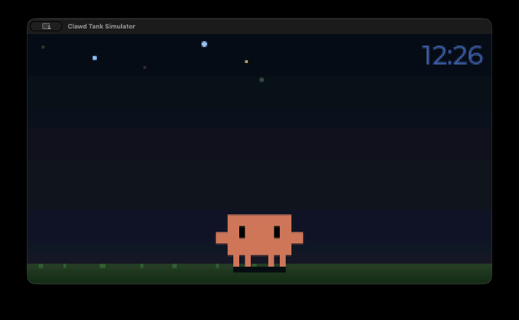
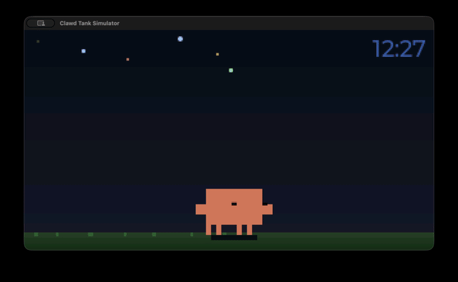
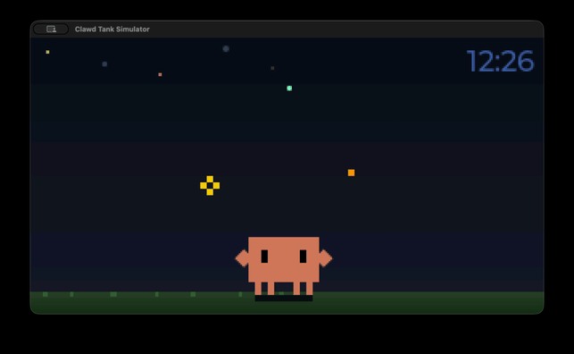
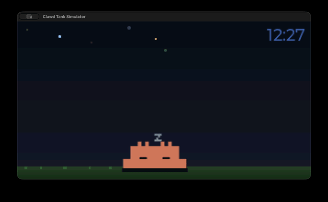
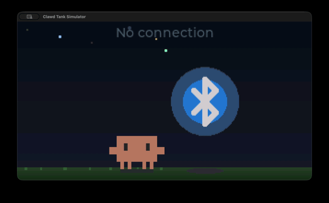

# Clawd Tank

A tiny desktop aquarium for your Claude Code sessions.

Clawd Tank is a physical notification display built on a [Waveshare ESP32-C6-LCD-1.47](https://s.click.aliexpress.com/e/_c4PGS55v) (320x172 ST7789). An animated pixel-art crab named Clawd lives on the screen, reacting to your coding session — alerting on new notifications, celebrating when you dismiss them, and sleeping when you're away.

<p align="center">
  
  
</p>

## How It Works

```
Claude Code hooks --> clawd-tank-notify --> daemon --> BLE --> ESP32-C6 display
                                                  \-> TCP --> Simulator (SDL2)
```

1. **Claude Code hooks** (`Stop`, `Notification`, `UserPromptSubmit`, `SessionEnd`) fire on session events
2. **clawd-tank-notify** (`~/.clawd-tank/clawd-tank-notify`) forwards the event to the daemon via Unix socket
3. The **daemon** maintains connections to one or more transports (BLE hardware, TCP simulator) and sends JSON payloads
4. The **firmware** (or simulator) renders Clawd + notification cards on the LCD via LVGL

## Components

| Directory | What | Language |
|-----------|------|----------|
| `firmware/` | ESP-IDF firmware (LVGL UI, NimBLE GATT server, SPI display) | C |
| `simulator/` | Native macOS simulator — runs the same firmware code without hardware | C |
| `host/` | Background daemon, Claude Code hook handler, macOS menu bar app | Python |
| `tools/` | Sprite pipeline (PNG to RLE-compressed RGB565), BLE debugging tool | Python |

## Hardware

- **Board**: [Waveshare ESP32-C6-LCD-1.47](https://s.click.aliexpress.com/e/_c4PGS55v)
- **Display**: 1.47" 320x172 ST7789V (SPI), 16-bit RGB565
- **SoC**: ESP32-C6FH8 (RISC-V, single core), 8MB flash, 4MB PSRAM (octal)
- **RGB LED**: Onboard WS2812B on GPIO8 — flashes on incoming notifications
- **Connectivity**: BLE 5.0 (NimBLE, peripheral role)

## Quick Start

### Simulator (no hardware needed)

```bash
brew install sdl2 cmake

cd simulator
cmake -B build && cmake --build build

# Interactive mode — opens an SDL2 window
./build/clawd-tank-sim

# Interactive + TCP listener — daemon can connect and drive it
./build/clawd-tank-sim --listen

# Headless mode — outputs PNG screenshots
./build/clawd-tank-sim --headless \
  --events 'connect; wait 500; notify "clawd-tank" "Waiting for input"; wait 2000; disconnect' \
  --screenshot-dir ./shots/ --screenshot-on-event
```

Interactive keys: `c` connect, `d` disconnect, `n` add notification, `1-8` dismiss, `x` clear, `s` screenshot, `q` quit.

When `--listen` is active (default port 19872), the daemon can connect over TCP and drive the simulator with the same JSON protocol used over BLE, enabling the full Claude Code → daemon → display pipeline without hardware.

See [simulator/README.md](simulator/README.md) for full CLI reference and JSON scenario support.

### Firmware

Requires [ESP-IDF 5.3.2](https://docs.espressif.com/projects/esp-idf/en/v5.3.2/esp32c6/get-started/index.html) (bundled in `bsp/esp-idf/`, activated via direnv).

```bash
cd firmware
idf.py build
idf.py -p /dev/ttyACM0 flash monitor
```

### macOS Menu Bar App

The menu bar app bundles the daemon with a status bar UI for controlling brightness, sleep timeout, connection, and an optional simulator transport toggle.

```bash
# Run from source
cd host && python -m clawd_tank_menubar

# Or build a standalone .app
cd host && pip install py2app && python setup.py py2app
open "dist/Clawd Tank.app"
```

On launch, the app automatically installs a hook handler script to `~/.clawd-tank/clawd-tank-notify`. To connect it to Claude Code, click **"Install Claude Code Hooks"** in the menu bar dropdown — this adds the required hooks to `~/.claude/settings.json`. Restart any running Claude Code sessions for hooks to take effect.

Logs are written to `~/Library/Logs/ClawdTank/clawd-tank.log`.

Pre-built DMGs are available on the [Releases](https://github.com/marciogranzotto/clawd-tank/releases) page.

### Host Daemon (standalone)

The daemon can also run standalone without the menu bar app:

```bash
cd host
pip install -r requirements.txt

# Run daemon with simulator transport
python -m clawd_tank_daemon --sim

# Run daemon with simulator only (no BLE)
python -m clawd_tank_daemon --sim-only
```

The daemon auto-starts on the first hook event. Logs at `~/.clawd-tank/daemon.log`.

## Features

- **Time display** — synced from host over BLE on connect (no WiFi/NTP needed)
- **RGB LED flash** — onboard WS2812B cycles through colors on new notifications
- **RLE sprite compression** — all sprite assets compressed ~14:1 (13MB raw → ~900KB)
- **Multi-transport** — daemon supports BLE (hardware) and TCP (simulator) transports simultaneously
- **Simulator bridge** — full pipeline works without hardware via `--listen` flag and TCP
- **Auto-reconnect** — daemon replays active notifications after reconnect on any transport
- **Config over BLE/TCP** — brightness and sleep timeout adjustable via config characteristic or TCP
- **macOS menu bar app** — per-transport status, brightness slider, sleep timeout, simulator toggle, hook installer, launch-at-login

## Clawd's Moods

| State | When | |
|-------|------|---|
| **Idle** | Connected, no notifications — Clawd hangs out, full-screen with clock |  |
| **Alert** | New notification arrives — Clawd shifts left, cards appear, LED flashes |  |
| **Happy** | Notifications dismissed |  |
| **Sleeping** | 5 minutes of inactivity |  |
| **Disconnected** | No BLE connection — "No connection" message |  |

## Tests

```bash
# C unit tests (notification store)
cd firmware/test && make test

# Python tests (host daemon + protocol)
cd host && pip install -r requirements-dev.txt && pytest
```

## Sprite Pipeline

Clawd's animations are pixel art generated as SVG by Gemini 3.1 Pro, exported as PNG frames, and converted to RLE-compressed RGB565 C headers:

```bash
python tools/png2rgb565.py frames/ output.h --name sprite_idle
```

## BLE Debugging

```bash
# Interactive BLE tool — connect, send notifications, read config
python tools/ble_interactive.py
```

## License

MIT
